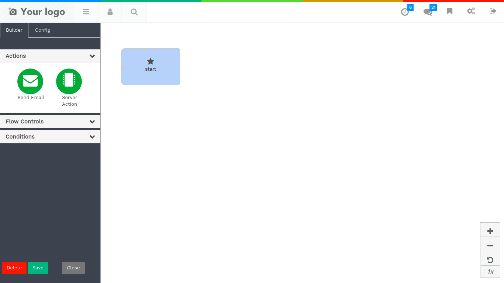

====================
Marketing Automation
====================

Marketing Automation is an automated technique for email marketing to the contacts.

Marketing Automation Configuration
===================================

Create Marketing Configuration by selection object and field.
Our base object will be contact and field could be anything on which
you wish to perform campaign.

* Model: Model on which Marketing is performed i.e contacts

* Field: Field a field used for mapping purpose

Marketing Campaign
===================

* Name: Name of the campaign

* Model: Select a configuration

* Domain: Domain will be auto filled after selection configuration.

Clicking on Activity Builder button, A Canvas will be provided where you can define
your marketing flow.

On left You will see tabs:
* Actions : send email or server action.
* Flow Controls : Timer for controlling your flow.
* Conditions : Conditions or domain to target your audience.

To send a mail, drag and drop Send Mail item on canvas.
Provide 3 options for sending mail

A model will pop up fill all fields:
* Name :- Subject of your email.
* Model :- Model Object of your email.
* template :- Mail template of your email.

.. image:: image/sc04.png
    :class: img-responsive

To run a server action, drag and drop Server Action item on canvas.
Provide 3 options for sending mail

A model will pop up fill all fields:
* Name :- Subject of your email.
* Model :- Model Object of your email.
* Server Action :- To run server action provide server action reference.

.. image:: image/sc05.png
    :class: img-responsive

The flow control plays role when you want to wait for a particular amount of time.

A model will pop up fill all fields:-
* Wait for :- Amount of time in integer.
* Waiting for :- Define minutes, hours etc.

.. image:: image/sc06.png
    :class: img-responsive

We can always filter our contact and send email according to that.

A model will pop up fill all fields:-
* Model :- Select model for which you are building domain.
* Domain :- Condition to filter your domain.
* Map field:- If your object is non contact object then you have to select
field which has relation with contact.

.. image:: image/sc07.png
    :class: img-responsive

Action Types
=============

To complete our flow we all have to connect lines in canvas, It will allow us to define connection of
activities.

.. image:: image/sc08.png
    :class: img-responsive

Hover over welcome mail block, You will see 9 options also called wheel of fortune.

* on send mail : Perform associated action after sending email.
* on email bounced : Perform associated action after email bounced.
* on child activity : Perform associated action after child activity.
* on email open : Perform associated action after email open.
* on email not open: Perform associated action after email not open.
* email replied : Perform associated action after email replied.
* email not replied : Perform associated action after email not replied.
* email clicked : Perform associated action after email clicked.
* email not clicked : Perform associated action after email not clicked.

Completing Activity Flow
=========================

It is necessary to connect all the lines from one activity to another,
Without connection activity don't make any sense.

Exploring Backend
==================

After completing backend you will see that there are few data inserted automatically.
These Data are made up from Activity builder.

.. image:: image/sc10.png
    :class: img-responsive

* Rule: This Rule is the condition we have provided in activity builder.
* Mail Activities: This are the lines of activities we build previously.

Generate Members and activities
================================

After flow is ready we have to click on get started button and click on generate members button
or a cron will run every 24 hours to generate members of the contact.

After generating mail members we will have member activity automatically generated.

Execute Activities
===================

After Creating members and activities the mail activities must be executed by the cron every 1 hour.

