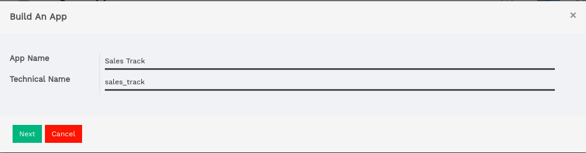
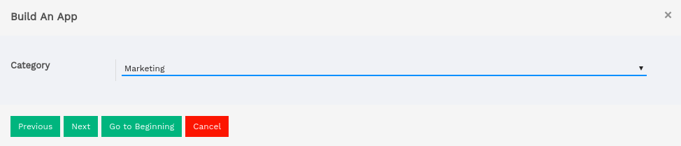
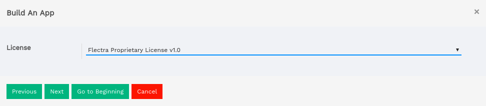
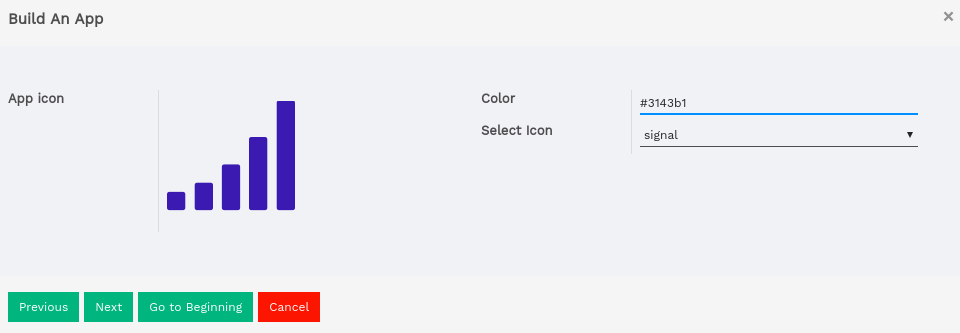
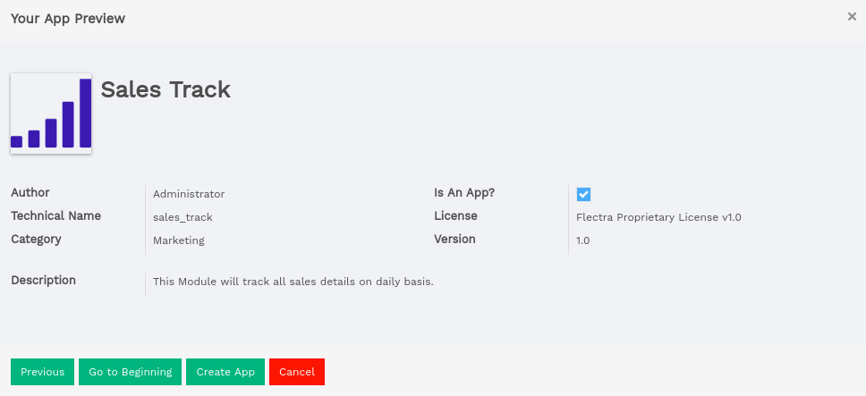
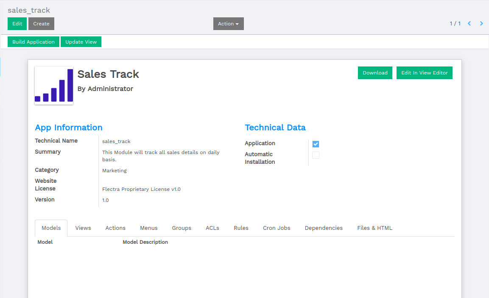
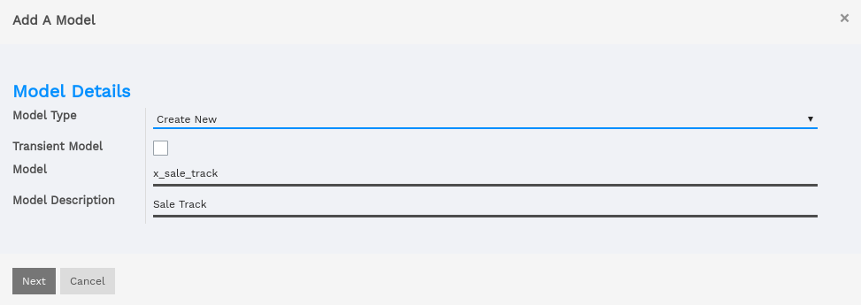
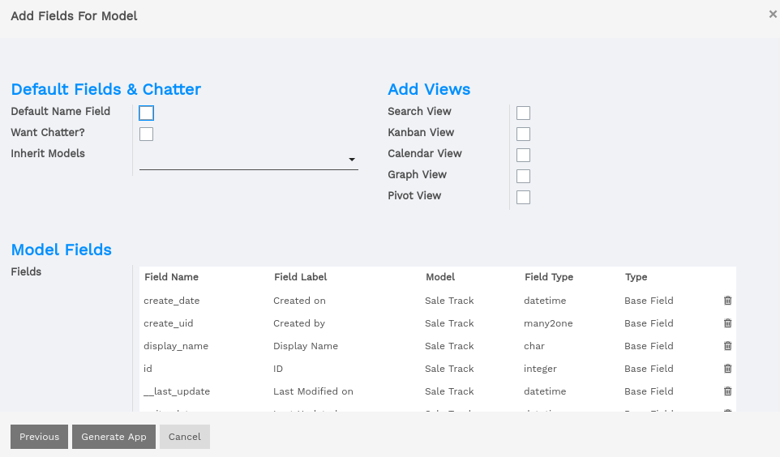
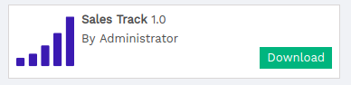

==============
Module Builder
==============

Module builder made easy building modules and views for your flectra apps and not just that
you can give this to someone else too with few clicks you can export the whole module.

Building Apps: With Module Builder
==================================

Click on build an app and follow steps.

* App Name: Name of the module.
* Technical Name: The name is autogenerated from the app name given.

Selecting Category
==================

* Category : Select category of your app.

Providing Version and Description
=================================

* Version : You can prefix version of your module.
* Description : Provide neat and descriptive app description for understanding the purpose of app.

.. image:: image/sc03.png
    :class: img-responsive

Giving A Valid License
======================
* License : You may have to consider legal aspects of your app so we provide all the license required
            for the app to be published or given for free.

Icon Builder
============
* App Icon: You can upload or build and image icon from module builder for your app.
* Color: Select the color of your app icon. works only if icon is not uploaded.
* Select Icon: Yes we got you covered with font awesome icon, select any fa icon available in the list
               and you will be able to see the preview of icon on left corner.

Previewing The Content
======================

Yes you heard it true, one can easily add a new smart button into the form view.
In this screen we can preview all the filled up details in Build An App

Exploring Module Builder
========================
Once app is created from build an app, we can explore the other menus and buttons.

* Models: This tab will be used for creating models for your app.
* Views: This tab will be used for creating views for your app generally XML.
* Actions: The Tab can be user for creating menu and view action in form of XML.
* Menus: Once app is ready we all require to have menu to access it.
* Groups: Groups can be used for providing access control over menus and views.
* ACLS: ACLs will be used for creating security files generally in CSV format.
* Rules: This tab will be used for rules for your app.
* Cron Job: The tab is used for creating corn jobs which runs in background.
* Dependencies: You can add dependencies for your module from this tab.
* Files & HTML: we all know that a module is incomplete without images and index files this tab
    provides facility to add custom files and htm content.

Build Application
=================

A module must have a model where your all data are stored.
Build Application is used for such purpose.

* Model Type: Create new or use exisiting one.
* Transient Model: Choose whether your model will be transient or not.
* Model: create the name of your model.

Fields and Chatter
==================

* Model Type: Create new or use exisiting one.
* Transient Model: Choose whether your model will be transient or not.
* Model: create the name of your model.

Download Zip File
=================

You can download whole module as a zip file and then export it into any system.
You will have to select flectra version you will see a zip file being downloaded.

